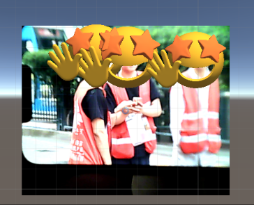

# MercuryAR

一个基于Unity开发的，可识别特定物体并渲染模型的AR程序。可打包并导出到安卓设备中使用。

各程序版本如下：

YOLO版本：YOLOv8  https://github.com/ultralytics/ultralytics

模型版本：ONNX 10

Unity版本：2022.3.23f1

barracuda版本：3.0.1  https://docs.unity3d.com/Packages/com.unity.barracuda@3.0/manual/index.html

备注：

1.YOLO文件夹中，存放着所有训练、预测、导出代码，相关依赖可见官方文档：https://docs.ultralytics.com/zh

2.除YOLO外，其它文件夹为Unity项目文件夹，可导入Unity中使用。其中，ObjectDetection.cs为项目代码，具体逻辑见注释。

3.若导入自用ONNX模型，可选择版本9或10，其它版本barracuda可能会报错

4.由于安卓设备会自动将摄像头画面旋转90度，此处在代码上已经做了抵消处理。如果需要在PC端使用，需要修改代码，去除其中与旋转有关的指令即可。
